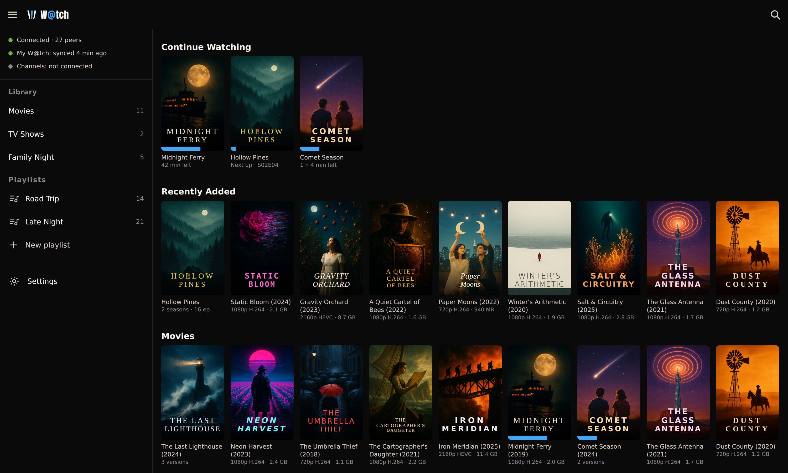
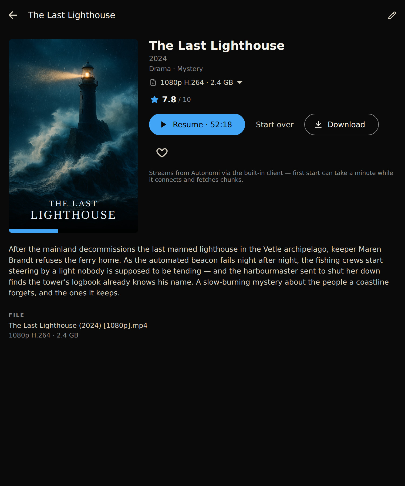
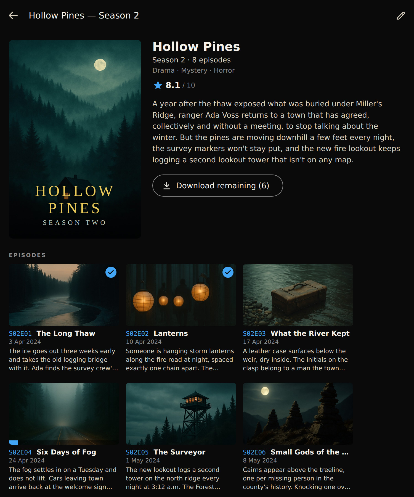

# W@tch

*Formerly **watch-it** — rebranded 2026-07-31. The repository keeps the name
`Watch-It` (GitHub disallows `@`), as do all technical identifiers.*

A beautiful, cross-platform media player for the **Autonomi network** — one codebase,
six platforms: **Android, Android TV, iPhone (iOS), Linux, Windows, and Mac.**

Think the Plex / Emby / [Silo](https://github.com/Silo-Server/) experience —
poster-wall library, rich metadata, resume-watching — but **with no server to install**.
W@tch is client-only: your media library is one or more lists of files stored
privately on the decentralized [Autonomi](https://github.com/WithAutonomi/ant-client)
network, streamed on demand or downloaded for offline watching.

*W@tch on Linux: connected to the live network, browsing a library of public-domain
films and shows streamed straight from Autonomi — no key, no account, no server.*

Want this exact library? It's a one-file download:
[**Public Domain.watch-list**](catalog/README.md) — 47 public-domain
films and episodes, posters and descriptions included, ready to import.

  
  

*Left — a film's detail page: pick between uploads of the same film (here 480p
or 1080p), stream it with Play, save it for offline with Download, or heart it
into the Favourites row. Right — a season page: every episode with stills, air
dates and descriptions, plus a one-tap Download season.*

## How it works

1. **Upload privately, keep the datamap.** Upload media with
   `ant file upload <file>` (private is the default — **don't** use `-p`).
   The upload prints a small `<file name>.datamap` file: that file *is* the
   key to the content. The encrypted chunks on the network are unreadable
   noise to everyone who doesn't hold it — unlike a *public* upload, whose
   datamap is itself stored on the network where any node operator can find
   it and watch the file. That's why W@tch takes datamaps only, and has no
   public-address entry type.
2. **Lists of media.** Import `.datamap` files into one or more lists; share
   a library as a `.watch-list` bundle (datamaps + artwork). A datamap grants
   full access, so share bundles as privately as the content deserves.
3. **Metadata from the name.** From the file name W@tch looks up the same public
   databases the media servers use (TMDB) and fetches artwork, description, and
   category to organize and display the collection as a poster-wall library. Name
   files with the Plex/Jellyfin convention —
   `Title (Year) {imdb-ttXXXXXXX} - [quality].ext` — **before uploading**; see
   [docs/NAMING.md](docs/NAMING.md).
4. **Stream or download.** Hit play to stream straight from the network, or download
   an item to the device for offline watching. Downloaded items play with the full
   library experience, no connectivity needed.

No server, no accounts, no telemetry. There is deliberately **no Plex/Emby/Jellyfin
server compatibility** — Autonomi *is* the backend.

## Status

**Working alpha on Android and Linux** — [the latest release](https://github.com/aautonomicc/Watch-It/releases)
ships a signed APK and a Linux AppImage that connect to the live Autonomi network
with an embedded Rust client (no gateway, no sidecar) and stream with
byte-exact seeking and a chunk cache with keep-ahead prefetch. Since
alpha.40 the library is **datamap-first**: entries are created from
`.datamap` files or `.watch-list` bundles, addresses are derived offline,
and every title's data map is on-device from the moment it's imported — so
first plays start fast (no cold network resolve) and nothing about your
library is discoverable on the network. TMDB metadata gives entries artwork, descriptions,
ratings, and categories from their file names, with shows grouped into
big-artwork Show → Season → Episode pages. Releases are keyless by design:
no TMDB key ships in the binaries — add your own free key (create one at
[themoviedb.org](https://www.themoviedb.org/settings/api)) in
Settings → Metadata, or skip it entirely: imported `.watch-list` bundles
carry metadata and posters, so bundle-importing users never need a key. Media lists can be created and
managed in-app; `.datamap` files import via a multi-select picker and
bundles import from a local file. Playback position
is remembered per title: the home screen opens with Continue Watching and
Recently Added rows, detail pages offer Resume / Start over with a Watched
badge, and finishing an episode auto-plays the next one via an Up-next
overlay. Downloads for offline watching shipped in alpha.30/.31: a download
queue with pause/resume that survives restarts and auto-pauses when the
connection drops, download badges on every card (check = downloaded,
progress ring = downloading, count on show/season cards), and offline-aware
playback — browsing always works offline, downloaded titles play locally
with the full library experience, and stream-only titles are gated with a
hint until the network returns. Alpha.32 rounds downloads out with a season
download-all button, a Downloads row on the home wall, queue multi-delete,
and a top-bar download meter. Alpha.33 ships `.watch-list` bundles: lists
export as plain text or as a bundle carrying TMDB metadata, posters,
offline-verified instant-play root maps, and optional watch history, with a
single auto-detecting Import button — see
[docs/BUNDLE-FORMAT.md](docs/BUNDLE-FORMAT.md). The Linux AppImage also
gained a proper taskbar icon. Alpha.34 shipped the keyless releases
described above, a show-level Download All button, home-row customization
(reorder/hide the home wall rows in Settings), and a taller watch-progress
bar on every card. Alpha.35 adds home-page library search: a search icon in
the home app bar (`/` or Ctrl+F on desktop) opens a full-screen
live-as-you-type search over your library — titles, years, and episode
markers like s02e05 — grouped into Shows / Movies / Episodes with the usual
download and watched badges. Alpha.36 gives W@tch its own identity: a
new striped popcorn-bucket logo as the launcher
and taskbar icon on both platforms and as the icon + wordmark lockup in
the app bar; alpha.37 turns the logo stripe and the app accent blue
(#42a5f5). Alpha.38 makes the connection self-healing and downloads
phone-friendly: the app automatically reconnects after a network loss
(cable unplugged, phone sleep/wake) with no restart needed, Android
downloads keep running in the background with a progress notification,
Settings → Network adds Wi-Fi/mobile-data policies (downloads Wi-Fi-only
by default, ask-before-streaming on cellular), and the demo movie's data
map ships inside the app so it starts fast on a fresh install. Alpha.40
removes public XOR addresses entirely in favour of the datamap-first model
above: adding media means importing `.datamap` files or bundles (spec v2 —
raw datamap members named by original filename, so even a hand-made
`zip lib.watch-list *.datamap` imports), the plain-text address list format
is gone, old bundles convert on import, and existing libraries migrate
automatically in a one-time background pass on first launch.
Alpha.42/.43 add library arrangement: an "Auto by type" mode that groups
the wall into virtual Movies / TV Shows lists, a left library drawer,
and per-list browse pages with genre filter chips. Alpha.44–.47
consolidate importing into a single multi-select "Add to library"
picker that works out what each file is, and fix importing real
`ant file upload` output (shrunk datamaps for files over ~12 MiB) and
the Android file picker's `.bin` rename. Alpha.48 turns the first run
into a full library: 48 verified-public-domain movies and episodes
(10 films, Petticoat Junction season 1, One Step Beyond) are seeded
with their data maps, artwork, and descriptions bundled in the app — a
fresh install shows a complete streamable poster wall, fully offline
metadata, no TMDB key needed — and every entry now shows its file size
and video format. Alpha.49 folds multiple uploads of the same title
into one card with a version picker on the detail page (e.g.
"480p H.264 · 570 MB" vs "1080p H.264 · 5.29 GB"), and alpha.50 puts
the search icon on the far left of the home app bar and the library
drawer button on the far right.
Docs:

- [docs/VISION.md](docs/VISION.md) — goals, non-goals, target users
- [docs/ARCHITECTURE.md](docs/ARCHITECTURE.md) — tech stack decision and app structure
- [docs/NAMING.md](docs/NAMING.md) — file naming convention (Plex/Jellyfin style)
- [docs/UI-DESIGN.md](docs/UI-DESIGN.md) — screens and look-and-feel
- [docs/BUNDLE-FORMAT.md](docs/BUNDLE-FORMAT.md) — `.watch-list` bundle spec v2 (datamap-first)
- [docs/SEED-CATALOG.md](docs/SEED-CATALOG.md) — the built-in public-domain seed catalog
- [docs/ROADMAP.md](docs/ROADMAP.md) — phased milestones

## License

W@tch's own source code is available under the **MIT License**
(see [LICENSE](LICENSE)).

The binaries we release (APK, AppImage) are a different matter: they
statically link the Autonomi network's
[self_encryption](https://crates.io/crates/self_encryption) crate, which is
**GPL-3.0**. That makes each released binary a combined work distributed
under the terms of the **GNU General Public License v3** — full text in
[COPYING.GPL-3.0](COPYING.GPL-3.0); the complete corresponding source is
this repository at the release tag. Every other bundled component is under
a permissive license (MIT / Apache-2.0 / BSD / CC0 / OFL) or a
GPLv3-compatible one (libmpv / FFmpeg). The full set of notices ships
inside the app: **Settings → About → Open-source licenses**.

In short: take the *source* under MIT; redistribute the *binaries* under
GPLv3.

### Bundled catalog

A fresh install seeds *Night of the Living Dead* (1968) in two versions
— a 480p archive.org upload and a 1080p re-encode, sharing one poster
card with a version picker (see
[docs/SEED-CATALOG.md](docs/SEED-CATALOG.md)). Alpha.48–.50 bundled a
48-title public-domain catalog; alpha.51 trimmed the bundle to NOTLD
only — installs that already seeded the full catalog keep it, and the
old uploads remain playable on the network — and the full catalog
(now 40 titles — *The Lady Vanishes* was removed 2026-08-11 after its
US copyright turned out to have been restored by the URAA, and
*The Hunchback of Notre Dame* (1939) plus *Petticoat Junction*
S01E16–E21 were removed the same day because their public-domain
status could not be confirmed with enough confidence) is
available as a downloadable
[`Public Domain.watch-list` bundle](catalog/README.md) you can import
in a couple of taps. The film was verified
public domain **in the United States** (released without a copyright
notice). Copyright terms differ elsewhere — in much of Europe
protection runs for 70 years after the death of the last author — so
outside the US, check your local rules before treating it as free.
